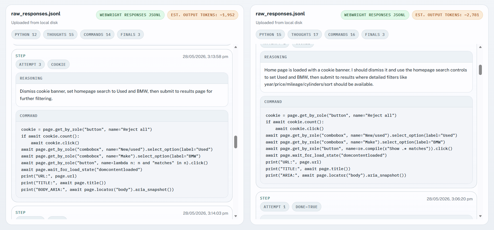

# Webwright

<p align="center">
  
</p>

<p align="center"><b>Turn Your Coding Models to Be State-of-the-art Browser Agents</b></p>

<p align="center">
  
  
  
  
</p>

- 📝 **Blog:** [Webwright: A Terminal Is All You Need For Web Agents](https://www.microsoft.com/en-us/research/articles/webwright-a-terminal-is-all-you-need-for-web-agents/)
- 🌐 **Project Page:** [microsoft.github.io/Webwright](https://microsoft.github.io/Webwright/)

Webwright gives LLM a terminal where it can launch multiple browser sessions to inspect the page and complete a web task. It captures and inspects page screenshots/states only when needed. It enforces each web task to be completed end-to-end within a re-runnable Python script, i.e. your web agent browsing history is a single code file. No multi-agent system, no graph engine, no plugin layer, no hidden orchestration — just a terminal, a browser, and a model.

Already got your favorite agents, and wonder how to make Claude Code, Codex, Hermes, OpenClaw more capable in browser tasks? Consider adding [Webwright plugin/skills](#-use-as-a-claude-code-skill)!

---

## 📰 News

- **2026-05-11** — Support Task2UI mode: Webwright completes the task and renders task results into an HTML-based web app you can easily view and reuse.  
- **2026-05-06** — Codex and Claude Code plugin manifests added; install via `/plugin install webwright@webwright`. OpenClaw and Hermes Agent integrations shipped; the same `skills/webwright/` folder now loads across Claude Code, Codex, OpenClaw, and Hermes.
- **2026-05-04** — Initial public release: ~1.5k LoC, OpenAI / Anthropic / OpenRouter backends, Playwright environment.

---

<details>
<summary><strong>💡 Motivation: Beyond Step-by-Step Web Interaction in a Stateful Browser</strong></summary>

Most web agents today treat the browser session itself as the workspace: at each step the model receives the current page state and predicts a single next operation — a click, a type, a DOM selector, or a short tool call. Whatever the format, the agent is locked into predicting one web action at a time inside a predefined interaction loop. That harness was useful when LLMs were weaker. As models get stronger at writing and debugging code, the same harness becomes a bottleneck.

Webwright takes a different stance: **separate the agent from the browser**, and treat the browser as something the agent can launch, inspect, and discard while developing a program. The persistent artifact is not the browser session — it's the **code and logs in the local workspace**.

- 🧱 **Robust, reusable interaction with web environments** — instead of fragile pixel-level actions, a coding agent with a terminal queries elements, waits for conditions, and handles dynamic behaviors like lazy loading or re-rendering. The resulting scripts can be rerun, adapted, and shared across tasks rather than rediscovered from scratch.
- ⚡ **Efficient composition of complex workflows** — multi-step interactions like selecting a date or filling a form become a compact program. Loops, functions, and abstractions let the agent generalize across similar tasks (e.g. different dates) without re-predicting the same low-level sequences. Fewer interaction rounds, faster execution, less error accumulation on long horizons.
- 🧪 **Workspace-as-state, not browser-as-state** — the agent can write exploratory scripts, spawn fresh browser sessions, and decide for itself when to capture screenshots and inspect failures, much like a human engineer iterating on an RPA script.
- 🪄 **Surprisingly effective despite being minimal** — this stripped-down setup turns out to handle complex and especially long-horizon web tasks well (see [Performance](#-performance)).

</details>

---

<details>
<summary><strong>🌟 Why Webwright</strong></summary>

Most web agent frameworks bury the actual agent loop under layers of abstractions. Webwright takes the opposite stance:

- 🪶 **Lightweight by design** — core agent loop in a single ~450-line file, Playwright environment in ~570 lines, CLI in ~150 lines.
- 🧩 **Pluggable model backends** — OpenAI, Anthropic, and OpenRouter, each ~150–200 lines.
- 🔍 **Zero hidden frameworks** — just `httpx`, `pydantic`, `playwright`, and `typer`.
- 🔁 **Flat prompt → observe → execute script loop** — readable end-to-end, easy to debug, easy to fork.
- 🧪 **Run-artifact first** — every run writes trajectories and screenshots to disk for inspection.

If you want a minimal, easy-to-debug starting point for browser-using agents instead of another heavyweight platform, this is it.

</details>

---

<details>
<summary><strong>🆚 How Webwright Differs From Other Browser-Agent Repos</strong></summary>

How they differ at the architectural level:

|                     | **Stagehand (Browserbase)**                                  | **agent-browser (Vercel)**                                                | **browser-use**                                       | **Webwright**                                                       |
| ------------------- | ------------------------------------------------------------ | ------------------------------------------------------------------------- | ----------------------------------------------------- | ------------------------------------------------------------------------- |
| **Paradigm**        | Hybrid: code + NL primitives (`act` / `extract` / `agent`)   | CLI tool that *another* agent (Claude Code, Codex, etc.) calls            | Autonomous LLM agent loop over DOM/AX snapshots       | **Coding agent with a terminal**; browser is just an environment it spawns |
| **Action space**    | Playwright code, or NL → LLM-translated Playwright           | Discrete subcommands (`open`, `click @e2`, `snapshot`, `eval`)            | Indexed click/type actions selected by the LLM        | **Free-form Python (writes Playwright scripts itself)**                       |
| **What is "state"?**| The browser session                                          | The browser session (held by daemon across CLI calls)                     | The browser session                                   | **The local workspace — code, screenshots, logs.** Browser is disposable. |
| **Loop shape**      | Imperative; `agent()` does multi-step when needed            | One CLI invocation per micro-step                                         | observe → predict next action → execute → repeat      | write code → execute → inspect screenshots → repair (code-as-action)      |
</details>


---

## 🎥 Demo
https://github.com/user-attachments/assets/4ed94cd5-11be-4daa-b2d7-1260a803baca

---

## 📊 Performance

State-of-the-art on two real-website benchmarks with a 100-step budget — see the [blog post](https://www.microsoft.com/en-us/research/articles/webwright-a-terminal-is-all-you-need-for-web-agents/) for full details.

- 🏆 **Online-Mind2Web (300 tasks):** **86.7%** with GPT-5.4 — highest among open-sourced harnesses in the AutoEval category. Claude Opus 4.7 reaches **84.7%**, and is stronger on the hard split (**80.5%** vs. 76.6% for GPT-5.4 at N=100).
- 🚀 **Odysseys (200 long-horizon tasks):** **60.1%** with GPT-5.4 (avg. 76.1 steps) — **+15.6 points** over the prior SOTA (Opus 4.6 at 44.5%, using vision based approach and persistent browser) and **+26.6 points** over base GPT-5.4 (33.5% using xy-coordinate prediction and persistent browser).
- 🧠 **Code-as-action beats coordinate prediction:** Webwright substantially outperforms a reproduced GPT-5.4 screenshot+xy-coordinate baseline across all difficulty splits.
- 🧰 **Small models + reusable tools:** generated scripts can be packaged as parameterized CLI tools — even **Qwen-3.5-9B** completes tasks well on Online-Mind2Web sites with 5+ tools available.

<p align="center">
  
  
</p>

---

## 🗺️ Project Map

```
webwright/
├── pyproject.toml           # package: webwright
├── src/webwright/
│   ├── run/cli.py           # CLI entrypoint (`webwright`)
│   ├── agents/default.py    # core agent loop
│   ├── environments/        # Playwright browser workspace
│   ├── tools/               # image_qa, self_reflection
│   ├── models/              # openai_model, anthropic_model, base
│   ├── config/              # base.yaml, model_openai.yaml, model_claude.yaml
│   └── utils/
├── assets/
│   └── task_showcase/       # tiny Flask dashboard for repeatable runs
│       ├── app.py
│       ├── templates/       # dashboard.html, task.html
│       └── tasks/<short_id>/ # task.json + report.json per task
├── tests/
└── outputs/                 # run artifacts (trajectories, screenshots)
```

---

## 📰 Task Showcase (repeatable runs as a dashboard)

A tiny Flask app under [`assets/task_showcase/`](assets/task_showcase/README.md) consolidates
Webwright runs for **repeatable** odyssey tasks (deals, inventory, listings,
job boards, weather, etc.) into a single dashboard. Each task ships only two
files — `task.json` (metadata) and `report.json` (curated, structured output:
sources + result sections like tables, lists, summaries) — and the templates
render them generically, so adding a new task is just dropping a new folder
in `assets/task_showcase/tasks/`.

```bash
pip install flask
python assets/task_showcase/app.py    # http://127.0.0.1:5005
```

To have Webwright produce a renderer-ready task folder at runtime, stack the
Task Showcase overlay:

```bash
python -m webwright.run.cli \
    -c base.yaml -c model_openai.yaml -c task_showcase.yaml \
    -t "<repeatable web task>" \
    --task-id my_repeatable_task \
    -o outputs/default
```

> **Note:** `report.json` is only generated when `-c task_showcase.yaml` is
> included. A plain `base.yaml` run produces `trajectory.json` and debug
> artifacts but no `report.json`.

The run writes `task_showcase/tasks/<short_id>/task.json` and `report.json`
inside the output workspace. Render those generated files without copying them
back into the repo:

```bash
python assets/task_showcase/app.py \
    --tasks-dir outputs/default/<run>/task_showcase/tasks
```

---

## 🚀 Quick Start

### Prerequisites

- Python 3.10+
- Chromium installed through Playwright
- An API key for your chosen backend (OpenAI, Anthropic, or OpenRouter)

### Install

```bash
pip install -e .
playwright install chromium
```

### Run

Export credentials for the configured backend (for example, `OPENAI_API_KEY`
with `model_openai.yaml` or `ANTHROPIC_API_KEY` with `model_claude.yaml`). The
`image_qa` and `self_reflection` tools use the same configured model by default,
so an Anthropic run does not require an OpenAI key. Then:

```bash
python -m webwright.run.cli \
    -c base.yaml -c model_openai.yaml \
    -t "Search for flights from SEA to JFK on 2026-08-15 to 2026-08-20" \
    --start-url https://www.google.com/flights \
    --task-id demo_openai \
    -o outputs/default
```

### 🚩 Flags

| Flag | Description |
|------|-------------|
| `-c` | Config file(s) from `src/webwright/config/` (stackable). |
| `-t` | Task instruction. |
| `--start-url` | Initial page. |
| `--task-id` | Output subfolder name. |
| `-o` | Output directory. |

---

## 🔌 Use as a Plugin

Webwright ships plugin manifests for both [Claude Code](https://docs.claude.com/en/docs/claude-code/plugins) ([`.claude-plugin/plugin.json`](.claude-plugin/plugin.json)) and [OpenAI Codex](https://developers.openai.com/codex/plugins) ([`.codex-plugin/plugin.json`](.codex-plugin/plugin.json)), with the shared skill at [`skills/webwright/`](skills/webwright/) and slash commands at [`skills/webwright/commands/`](skills/webwright/commands/). The host agent drives the Webwright loop natively — no extra LLM API key or cost beyond your host subscription. Hosts that read PNG screenshots natively skip the `image_qa` / `self_reflection` tools.

Common runtime deps (install once after either path):

```bash
pip install -e .
playwright install chromium
```

<details>
<summary><b>Claude Code</b></summary>

### Install

Install through the bundled marketplace inside Claude Code:

```text
# 1. Add this repo as a Claude Code plugin marketplace
/plugin marketplace add microsoft/Webwright

# 2. Install the plugin from that marketplace
/plugin install webwright@webwright
```

Prefer a local checkout? Point the marketplace command at the cloned repo instead:

```text
/plugin marketplace add /absolute/path/to/Webwright
/plugin install webwright@webwright
```

### Use

**Start a new Claude Code session** after installing — plugins are loaded at session start and won't appear until you restart.

You can either ask Claude Code in plain English (the skill auto-activates from its description), or use one of the slash commands:

```
/webwright:run search Google Flights for flights from SEA to JFK on 2026-08-15 to 2026-08-20
/webwright:craft search a ticket on Google Flights from LAX to SFO depart June 7 return June 14
```

- `/webwright:run` (or any plain prompt) produces a **one-shot** `final_script.py` for the literal task values.
- `/webwright:craft` produces a **reusable CLI tool**: `final_script.py` becomes one parameterized function with a Google-style `Args:` docstring and an `argparse` wrapper whose flags default to the concrete task values, so you can rerun it later with different arguments — e.g. `python final_script.py --origin JFK --destination LAX --depart-date 2026-07-01`.

In both modes Claude Code scaffolds a workspace with `plan.md`, runs instrumented Playwright scripts under `final_runs/run_<id>/`, and visually self-verifies each critical point against the saved screenshots.

</details>

<details>
<summary><b>OpenAI Codex</b></summary>

### Install

Codex reads Claude-style marketplaces, so the same repo works as a Codex plugin marketplace. From the Codex CLI:

```bash
# 1. Add this repo as a Codex plugin marketplace
codex plugin marketplace add microsoft/Webwright

# 2. Open the plugin browser and install Webwright
codex
/plugins
```

Prefer a local checkout?

```bash
codex plugin marketplace add /absolute/path/to/Webwright
```

Then restart Codex so the new marketplace and plugin are picked up.

### Use

In a new Codex thread, either ask in plain English (the skill auto-activates from its description) or invoke the bundled skill explicitly with `@webwright`:

```
@webwright search Google Flights for flights from SEA to JFK on 2026-08-15 to 2026-08-20
```

Codex scaffolds a workspace with `plan.md`, runs instrumented Playwright scripts under `final_runs/run_<id>/`, and visually self-verifies each critical point against the saved screenshots.

To turn the plugin off without uninstalling, set its entry in `~/.codex/config.toml` to `enabled = false` and restart Codex.

</details>

<details>
<summary><b>🦞 OpenClaw</b></summary>

### Install

Install directly from a local checkout (path, archive, npm spec, git repo, or `clawhub:` spec all work):

```bash
openclaw plugins install /absolute/path/to/Webwright
openclaw gateway restart   # reload so the plugin and skill are picked up
```

Verify:

```bash
openclaw plugins list | grep webwright
openclaw skills  list | grep webwright   # should show "✓ ready"
```

### Use

The `webwright` skill is now available to any OpenClaw agent surface (CLI, Telegram, etc.) — invoke it by asking the agent in natural language, or via the slash commands shipped under [`skills/webwright/commands/`](skills/webwright/commands/), e.g. `/webwright run <task>`.

To uninstall: `openclaw plugins uninstall webwright`.

</details>

<details>
<summary><b>Hermes Agent</b></summary>

### Install

[Hermes Agent](https://github.com/NousResearch/hermes-agent) is a [skills-compatible client](https://agentskills.io), so the same `skills/webwright/` folder loads as a Hermes skill. Symlink it into your Hermes user-skills directory:

```bash
mkdir -p ~/.hermes/skills
ln -sfn /absolute/path/to/Webwright/skills/webwright ~/.hermes/skills/webwright
```

No Hermes-specific manifest is needed; only `SKILL.md` is loaded.

### Use

Start Hermes (`hermes`) and ask it to drive a web task in natural language — the skill auto-activates from its description. You can also invoke it explicitly with `/webwright`.

Note: the named subcommands shipped under [`skills/webwright/commands/`](skills/webwright/commands/) (`/webwright:run`, `/webwright:craft`) are a Claude Code / Codex convention and are inert in Hermes; the skill itself still works end-to-end.

</details>

## 📃 Trajectory Comparison & Viewer

You can run the same tasks using the Webwright harness and its Codex / GitHub Copilot skill variant, and see how token usage and trajectories stack up between different harnesses. The trajectory viewer supports Codex, GitHub Copilot and Webwright harness traces.



### How to use

```bash
cd assets/compare_trajectory/
python3 -m http.server
```

Open the webpage in your browser and upload the Webwright `raw_responses.jsonl` and attach `trajectory.json` to view. Then on the other side you can upload your Codex or GitHub Copilot trace.

### Obtaining Codex traces:

```
ls ~/.codex/sessions/2026/MONTH/DAY/SESSION_ID.jsonl
```

### Obtaining GitHub Copilot traces:

```
/export file session
-> session.md is the uploadable trace
```

### Quick Comparison

#### "Find the cheapest used 8-cylinder bmw made between 2005-2015 and priced from 25,000 to  50,000 dollars with mileage less than 50,000 miles or less."

| Tokens | Webwright Harness (Local Browser Mode) | Codex Webwright Skill |
| --- | ---: | ---: |
| Input | 420,433 | 3,271,143 |
| Output | 3,593 | 20,040 |
| Reasoning | 0 | 4,410 |
| Cached | 217,216 | 3,081,3440 |
| Total | 424,026 | 3,291,183 |

Individual runs and results may vary.

---

## Credits

- [SWE-agent/mini-swe-agent](https://github.com/SWE-agent/mini-swe-agent/tree/main) — design inspiration for the minimal agent loop.
- [Playwright](https://playwright.dev/) — browser automation.

## Citation

If you use Webwright in your research or build on it, please cite this repository:

```bibtex
@misc{webwright2026,
  title        = {Webwright: A terminal is all you need for web agents},
  author       = {Lu, Yadong and Xu, Lingrui and Huang, Chao and Awadallah, Ahmed},
  year         = {2026},
  howpublished = {\url{https://github.com/microsoft/Webwright}},
  note         = {GitHub repository}
}
```
