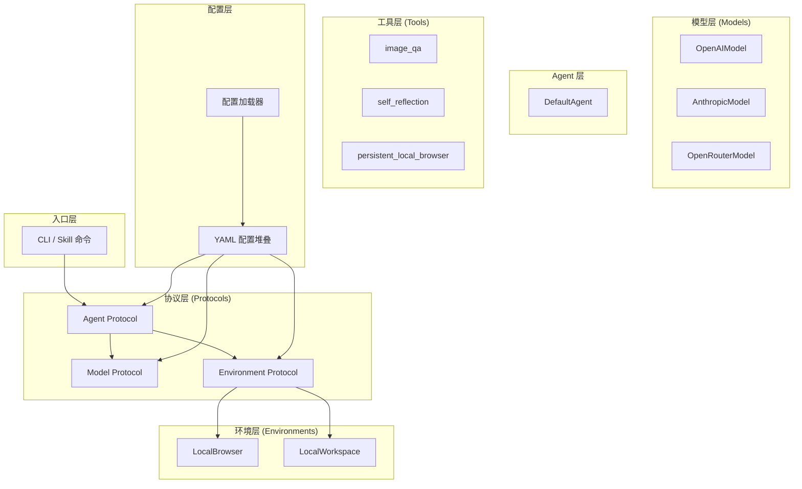
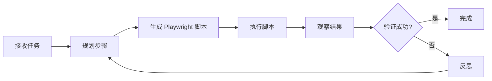
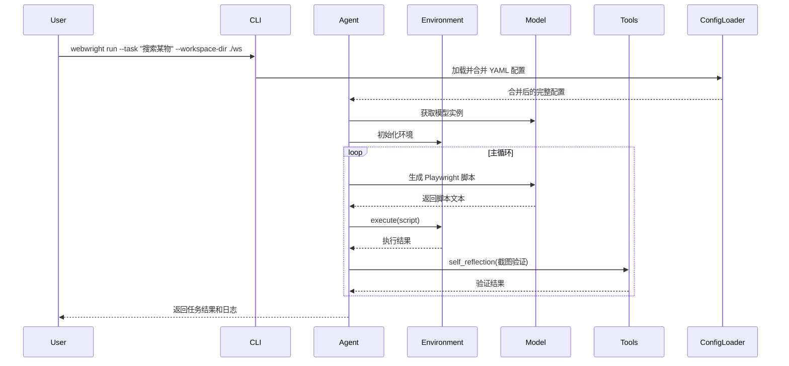

# Webwright 项目架构文档

## 1. 项目概述

### 1.1 项目目的

**Webwright** 是一个轻量级的 Web Agent 框架，让大型语言模型（LLM）通过编写和执行 Playwright 脚本来完成网络任务。与传统的逐步操作范式不同，Webwright 采用 **"代码即动作"** 的设计理念。

核心设计原则：
- 将浏览器视为 Agent 可以启动、检查和丢弃的环境
- 持久化产物是本地工作区中的**代码和日志**，而非浏览器会话
- 支持 OpenAI、Anthropic (Claude)、OpenRouter 多种模型后端

### 1.2 核心特性

| 特性 | 说明 |
|------|------|
| 轻量级设计 | 核心代码约 1.5k 行，无隐藏框架 |
| 插件式架构 | 可作为 Claude Code、Codex、OpenClaw、Hermes Agent 的插件使用 |
| 可复用脚本 | 生成的脚本可参数化作为 CLI 工具重复使用 |
| 自验证机制 | 内置 `self_reflection` 工具进行截图验证 |
| 多模型支持 | OpenAI Responses API、Anthropic Messages API、OpenRouter |

---

## 2. 目录结构

```
Webwright/
├── src/webwright/                 # 主代码包
│   ├── __init__.py               # 协议定义 (Agent, Environment, Model)
│   ├── exceptions.py              # 异常类定义
│   ├── agents/                    # Agent 核心
│   │   ├── __init__.py           # Agent 工厂函数
│   │   └── default.py            # 默认 Agent 实现
│   ├── models/                    # 模型后端
│   │   ├── __init__.py           # 模型工厂函数
│   │   ├── base.py               # 基础模型类
│   │   ├── openai_model.py        # OpenAI Responses API
│   │   ├── anthropic_model.py     # Anthropic Messages API
│   │   └── openrouter_model.py    # OpenRouter Chat Completions
│   ├── environments/              # 环境实现
│   │   ├── __init__.py           # 环境工厂函数
│   │   ├── local_browser.py       # 本地浏览器环境
│   │   └── local_workspace.py     # 本地工作区环境
│   ├── tools/                     # 工具集
│   │   ├── __init__.py
│   │   ├── _model_config.py       # 工具模型配置加载
│   │   ├── image_qa.py            # 图像问答工具
│   │   ├── self_reflection.py     # 两阶段截图评判
│   │   └── persistent_local_browser.py  # 持久化浏览器会话
│   ├── config/                    # 配置文件
│   │   ├── __init__.py           # 配置加载工具
│   │   ├── base.yaml             # 基础配置
│   │   ├── model_openai.yaml     # OpenAI 模型配置
│   │   ├── model_claude.yaml     # Claude 模型配置
│   │   ├── model_openrouter.yaml # OpenRouter 模型配置
│   │   ├── local_browser.yaml    # 本地浏览器模式配置
│   │   ├── local_workspace.yaml  # 本地工作区配置
│   │   ├── persistent_browser.yaml # 持久化浏览器配置
│   │   └── task_showcase.yaml    # 任务展示配置
│   ├── run/                       # 运行入口
│   │   ├── __init__.py
│   │   ├── cli.py                # CLI 入口
│   │   └── run_command.sh        # 运行脚本
│   └── utils/                     # 工具函数
│       ├── __init__.py
│       ├── logging.py             # 日志工具
│       ├── runtime.py             # 异步运行时助手
│       └── serialize.py          # 序列化/配置合并工具
├── skills/webwright/              # Claude Code/Codex 技能包
│   ├── SKILL.md                  # 技能说明
│   ├── commands/                  # 斜杠命令
│   │   ├── run.md               # /webwright:run 命令
│   │   └── craft.md            # /webwright:craft 命令
│   └── reference/                 # 参考文档
│       ├── playwright_patterns.md # Playwright 模式参考
│       ├── workflow.md           # 工作流参考
│       └── cli_tool_mode.md      # CLI 工具模式
├── tests/                         # 测试
│   ├── conftest.py
│   └── unit/
│       └── test_tool_model_routing.py
├── docs/
│   └── architecture.md           # 架构文档
└── pyproject.toml                # 项目配置
```

---

## 3. 核心组件架构

### 3.1 架构图



### 3.2 协议层 (`__init__.py`)

Webwright 用 `typing.Protocol` 定义了三大组件的接口契约，实现了解耦：

```python
# Model 协议 - 模型后端必须实现
class Model(Protocol):
    def __call__(self, messages, **kwargs) -> str: ...
    def query(self, messages, **kwargs) -> dict: ...
    def format_message(self, **kwargs) -> dict: ...
    def format_observation_messages(...) -> list: ...
    def get_template_vars(self, **kwargs) -> dict: ...
    def serialize(self) -> dict: ...

# Environment 协议 - 环境必须实现
class Environment(Protocol):
    def prepare(self, **kwargs) -> None: ...
    def execute(self, action, cwd="") -> dict: ...
    def get_template_vars(self, **kwargs) -> dict: ...
    def serialize(self) -> dict: ...
    def close(self) -> None: ...

# Agent 协议 - Agent 必须实现
class Agent(Protocol):
    def run(self, task, **kwargs) -> dict: ...
    def save(self, path, *extra_dicts) -> dict: ...
```

| Protocol | 职责 | 关键方法 |
|----------|------|----------|
| `Model` | 大语言模型封装 | `__call__`（生成文本）、`query`（结构化输出）、`format_message`、`serialize` |
| `Environment` | 执行环境（如浏览器/终端） | `prepare`（初始化）、`execute`（执行动作）、`close`（清理） |
| `Agent` | 主控循环 | `run`（运行任务）、`save`（保存轨迹） |

---

## 4. 模型层 (`models/`)

### 4.1 模型工厂 (`__init__.py`)

实现了一个模型注册中心，根据配置字符串动态实例化对应的 LLM 后端：

```python
_MODEL_MAPPING = {
    "openai": "webwright.models.openai_model.OpenAIModel",
    "anthropic": "webwright.models.anthropic_model.AnthropicModel",
    "openrouter": "webwright.models.openrouter_model.OpenRouterModel",
}

def get_model(config: dict, *, default_type: str = "openai") -> Model:
    copied = copy.deepcopy(config)
    model_class = copied.pop("model_class", default_type)
    return get_model_class(model_class)(**copied)
```

### 4.2 基础模型类 (`base.py`)

定义所有模型后端的公共接口和通用逻辑，包括消息格式化和模板变量处理。

### 4.3 具体模型实现

| 模型 | 文件 | API 风格 |
|------|------|----------|
| OpenAI | `openai_model.py` | Responses API |
| Anthropic | `anthropic_model.py` | Messages API |
| OpenRouter | `openrouter_model.py` | Chat Completions |

---

## 5. 环境层 (`environments/`)

### 5.1 LocalBrowser

本地浏览器执行环境，封装 Playwright 的浏览器操作：

- `prepare()`：启动浏览器实例
- `execute(action)`：执行 Playwright 脚本
- `close()`：关闭浏览器

### 5.2 LocalWorkspace

本地工作区环境，管理文件系统和脚本执行：

- `prepare()`：创建工作目录结构
- `execute(action)`：执行文件系统操作或脚本
- `close()`：清理临时文件

---

## 6. Agent 层 (`agents/`)

### 6.1 DefaultAgent

默认 Agent 实现，是 Webwright 的核心执行引擎。主循环：



关键能力：
- **脚本生成**：根据任务描述生成 Playwright Python 脚本
- **执行控制**：运行脚本并捕获输出
- **自我验证**：调用 `self_reflection` 工具验证结果
- **轨迹保存**：将执行过程保存为可复现的日志

---

## 7. 异常体系 (`exceptions.py`)

采用"异常作为控制流"的设计，用类型区分中断原因：

```python
class InterruptAgentFlow(Exception):
    """基类，表示需要中断当前 agent 主循环"""
    def __init__(self, *messages: dict):
        self.messages = list(messages)

class LimitsExceeded(InterruptAgentFlow):
    """步数/轮数/预算等限制超限"""

class Submitted(InterruptAgentFlow):
    """任务已提交/已完成"""

class FormatError(InterruptAgentFlow):
    """模型输出格式错误"""
```

---

## 8. 配置系统

### 8.1 配置加载 (`config/__init__.py`)

支持 YAML 配置的堆叠合并，通过 `recursive_merge` 实现深层配置继承。

### 8.2 配置文件

| 文件 | 用途 |
|------|------|
| `base.yaml` | 基础配置（包含 Agent、Environment 的默认参数） |
| `model_*.yaml` | 模型配置（API key、模型名称、温度参数等） |
| `local_browser.yaml` | 本地浏览器模式配置 |
| `local_workspace.yaml` | 本地工作区配置 |
| `persistent_browser.yaml` | 持久化浏览器配置 |
| `task_showcase.yaml` | 任务展示配置 |

### 8.3 全局配置

`src/webwright/__init__.py` 中的全局配置初始化：

```python
global_config_dir = Path(
    os.getenv("MSWEBA_GLOBAL_CONFIG_DIR") or user_config_dir("webwright")
)
global_config_file = global_config_dir / ".env"
dotenv.load_dotenv(dotenv_path=global_config_file)
```

优先级：
1. 环境变量 `MSWEBA_GLOBAL_CONFIG_DIR`
2. 系统默认用户配置目录（`~/.config/webwright`）
3. 加载 `.env` 文件中的敏感配置（如 API key）

---

## 9. 工具层 (`tools/`)

### 9.1 image_qa

图像问答工具，让模型分析图片内容。接收截图，返回对图像内容的文本描述或问答结果。

### 9.2 self_reflection

两阶段截图评判器，用于自动验证任务执行结果：

```
Stage 1: 并行评分  -->  Stage 2: 最终裁决
┌──────────────┐         ┌──────────────┐
│ 每张截图评分  │         │ 汇总所有     │
│ 1-5分 + 理由 │  ───►   │ Reasoning    │
└──────────────┘         │ → success/  │
                         │   failure    │
                         └──────────────┘
```

### 9.3 persistent_local_browser

持久化本地浏览器管理器，让 Chromium 脱离当前 shell 长期运行：

```bash
# 创建会话
python -m webwright.tools.persistent_local_browser create --workspace-dir ./ws

# 连接复用
python -c "
from playwright.sync_api import sync_playwright
import json
s = json.loads(open('.lb_session.json').read())
with sync_playwright() as p:
    browser = p.chromium.connect_over_cdp(s['connectUrl'])
    page = browser.new_page()
"

# 释放会话
python -m webwright.tools.persistent_local_browser release --workspace-dir ./ws
```

### 9.4 工具模型配置 (`_model_config.py`)

确保工具（`image_qa`、`self_reflection`）和主 Agent 使用同一个 LLM 后端：

```
CLI 运行时合并配置 → 写入 workspace/config_snapshot/merged_config.yaml
                           ↓
       工具调用 load_tool_model()
                           ↓
              读取 merged_config.yaml → 提取 model 块 → get_model()
```

---

## 10. 入口层 (`run/`)

### 10.1 CLI (`cli.py`)

主命令行入口，处理以下命令：

| 命令 | 功能 |
|------|------|
| `webwright run` | 执行单个任务 |
| `webwright craft` | 生成可复用 CLI 工具 |

### 10.2 执行流程



---

## 11. Skill 与插件机制

### 11.1 Skill 结构 (`skills/webwright/`)

```
skills/webwright/
├── SKILL.md              # 技能定义
├── commands/
│   ├── run.md           # /webwright:run 命令定义
│   └── craft.md         # /webwright:craft 命令定义
└── reference/
    ├── playwright_patterns.md  # Playwright 模式参考
    ├── workflow.md             # 工作流参考
    └── cli_tool_mode.md        # CLI 工具模式参考
```

### 11.2 插件与 Skill 的区别

| | **插件 (Plugin)** | **Skill** |
|---|---|---|
| **本质** | 安装和分发的包装单位 | 具体的**能力定义** |
| **内容** | 元数据（名称、版本、作者、描述） | 工作流、工具权限、提示词、命令定义 |
| **文件** | `.codex-plugin/plugin.json` | `skills/<name>/SKILL.md` |
| **关系** | 一个插件可以指向一个或多个 skill | 同一个 skill 可被多个插件/宿主共享 |

### 11.3 支持的宿主平台

- **Claude Code**: `/plugin marketplace add microsoft/Webwright`
- **OpenAI Codex**: `codex plugin marketplace add microsoft/Webwright`
- **OpenClaw**: `openclaw plugins install microsoft/Webwright`
- **Hermes Agent**: 链接 skills 目录即可

---

## 12. 执行上下文初始化 (`__init__.py`)

`src/webwright/__init__.py` 处理三件事：

### 12.1 可选依赖的容错导入

```python
try:
    import dotenv
except ModuleNotFoundError:
    class _DotenvShim:
        @staticmethod
        def load_dotenv(*args, **kwargs):
            return False
    dotenv = _DotenvShim()
```

如果 `python-dotenv` 未安装，提供一个静默降级的 shim。

### 12.2 全局配置目录与 .env 加载

```python
package_dir = Path(__file__).resolve().parent
global_config_dir = Path(
    os.getenv("MSWEBA_GLOBAL_CONFIG_DIR") or user_config_dir("webwright")
)
global_config_dir.mkdir(parents=True, exist_ok=True)
global_config_file = global_config_dir / ".env"
dotenv.load_dotenv(dotenv_path=global_config_file)
```

### 12.3 `__all__` 导出

控制 `from webwright import *` 时导出的公开 API。

---

## 13. 工具函数 (`utils/`)

| 文件 | 功能 |
|------|------|
| `logging.py` | 日志工具 |
| `runtime.py` | 异步运行时助手 |
| `serialize.py` | 递归字典合并工具（`recursive_merge`），用于配置堆叠 |

---

## 14. 总结

Webwright 是一个设计精良的 Web Agent 框架，核心设计要点：

1. **协议驱动**：通过 `Model`、`Environment`、`Agent` 三大协议实现组件解耦
2. **配置优先**：YAML 配置堆叠机制，支持灵活的模型和环境切换
3. **代码即动作**：以 Playwright 脚本为执行单元，产物可复用
4. **自验证闭环**：内置 `self_reflection` 实现执行结果的自动验证
5. **多宿主支持**：作为 Skill/插件，可无缝接入 Claude Code、Codex 等主流 Agent 平台
